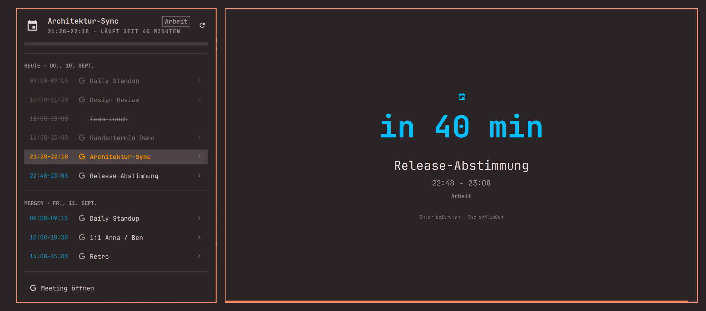

# OMeetingBar

**MeetingBar for Omarchy.** Your next Google Calendar meeting in the bar, a two-day agenda
popup on click — and a fullscreen alert shortly before a meeting starts that you cannot miss,
because ordinary notifications are exactly what you miss when you are deep in work.



## Why

The fullscreen alert is the point of this plugin. A minute before a meeting the screen goes
dark on every monitor and shows the meeting, the countdown and the join key. A toast in the
corner does not do that. The bar entry and the agenda popup are what MeetingBar users expect
around it.

- **Bar entry** — the next meeting with time, title and countdown, coloured by state:
  turquoise while it is ahead, orange once it is running.
- **Agenda popup** (left click) — today and tomorrow, MeetingBar-style: a timeline strip, one
  row per meeting with a join glyph, finished rows dimmed, the running one emphasised, declined
  invitations struck through, and footer actions (join, create, refresh, open calendar).
- **Fullscreen alert** — configurable lead time (default 60 s), auto-dismiss, `Enter` joins the
  meeting, `Esc` dismisses. It also sends a critical notification, plays a sound and wakes the
  display, so the alert reaches you even when the overlay cannot (see limits).
- **Google Workspace / Google Calendar** through GNOME Online Accounts + evolution-data-server.
  No Google Cloud project, no OAuth client of your own: GOA ships a verified one.

## Limits — read these first

1. **A locked session cannot be drawn over.** Omarchy's lock is `ext-session-lock`, which
   renders above every layer-shell surface. The plugin therefore holds an idle inhibitor from
   ten minutes before a meeting so the session does not lock into the alert; if it is already
   locked, the notification and the sound still fire and the fullscreen alert is shown as soon
   as you unlock, as long as the meeting is still inside its grace window.
2. **A suspended laptop is not woken.** `WakeSystem=` needs system privileges; a user plugin
   cannot do it. After resume, a meeting that started within the grace window (default
   5 min) still alerts.
3. **The `ics` backend lags.** Google regenerates private iCal feeds roughly once a day. It
   exists as a backstop only; use `eds`.
4. **UI strings are German.** The author is. Contributions for i18n are welcome.
5. **The timeline strip has no hour numbers.** A `Text` in that row triggers a Qt polish loop
   on the author's machine that was bisected but not root-caused; the notches carry the hour
   grid. Details in `docs/SPEC.md`.

## Requirements

- Omarchy 4.x (Quickshell shell). Verified on Omarchy 4.0.x, Hyprland 0.56, Quickshell 0.3.1,
  Qt 6.11.
- For the `eds` backend (Google Calendar):
  `evolution-data-server`, `gnome-online-accounts`, `gnome-online-accounts-gtk`
  (the standalone account dialog — no GNOME session or `gnome-control-center` needed),
  `python-gobject` (already on Omarchy). About 11 packages / 70 MiB on a stock install.
- Sound: `pipewire-audio` (`pw-play`) and `sound-theme-freedesktop` — both on Omarchy already.

## Install

```bash
omarchy plugin add https://github.com/disy-mk/OMeetingBar.git
cd ~/.config/omarchy/plugins/io.github.disy-mk.omeetingbar
./install.sh
```

`install.sh` never runs `sudo`. It validates the manifest, creates
`~/.config/omarchy/omeetingbar.json` from `config.example.json` (only if absent), registers
the plugin with the running shell, puts the widget on the bar and installs a small wrapper
at `~/.local/bin/omeetingbar-fetch`. It then prints the two steps only you can do:

```bash
sudo pacman -S --needed evolution-data-server gnome-online-accounts gnome-online-accounts-gtk
gnome-online-accounts-gtk     # add your Google account, enable "Calendar"
omarchy restart shell
```

Until the packages are installed the bar shows a dim `󰃭 —` with the reason in its tooltip;
`omarchy-shell omeetingbar test` shows the fullscreen alert regardless, so you can see it
before connecting anything.

## Remove

```bash
~/.config/omarchy/plugins/io.github.disy-mk.omeetingbar/install.sh --uninstall
omarchy plugin remove io.github.disy-mk.omeetingbar
```

`--uninstall` removes the wrapper, the runtime cache (`$XDG_RUNTIME_DIR/omeetingbar/`) and
the widget's bar entry. It leaves `~/.config/omarchy/omeetingbar.json` in place (your
settings) and does not touch the packages or the Google account — remove those yourself if
you want them gone (`gnome-online-accounts-gtk`, `sudo pacman -Rs …`).

## Configuration — `~/.config/omarchy/omeetingbar.json`

Every key is optional; the defaults below apply when it is missing. The file is re-read on
save.

| Key | Default | Meaning |
|---|---|---|
| `backend` | `"eds"` | `eds` = Google via GOA/Evolution. `ics` = private iCal URLs (backstop, see limits). `demo` = synthetic events, no account needed. |
| `ics_urls` | `[]` | Private ICS URLs for `backend: "ics"`. Treated as secrets — never logged. |
| `lookahead_minutes` | `720` | Extends the agenda beyond tomorrow; can never shorten it. |
| `refresh_seconds` | `300` | Minimum spacing between network refreshes (EDS `refresh_sync`). EDS alone would poll hourly. |
| `fetch_interval_seconds` | `60` | How often the service reads the local calendar cache. Backs off to 15 min while a backend keeps failing. |
| `alert_lead_seconds` | `60` | Fullscreen alert this many seconds before start. |
| `auto_dismiss_seconds` | `90` | The alert closes itself; `0` keeps it until dismissed (hard cap 10 min). |
| `colors.running` | `#FF9500` | Colour for a running meeting — bar entry and alert countdown. `#rrggbb` only. |
| `colors.upcoming` | `#00BEFF` | Colour for an upcoming meeting. |
| `inhibit_lead_seconds` | `600` | Hold a Wayland idle inhibitor from this long before start until `start + grace`, so the session cannot lock into the alert. |
| `grace_seconds` | `300` | A meeting whose start is at most this long ago still alerts (suspend, lock). Older ones never do. |
| `sound` | `…/alarm-clock-elapsed.oga` | Played with `pw-play`. Empty string = silent. |
| `notify` | `true` | Also send `omarchy-notification-send -u critical` (bypasses DND). |
| `wake_display` | `true` | `omarchy-brightness-display on` before the alert. |
| `skip_all_day` | `true` | Keep all-day entries out of the cache. All-day entries never alert either way. |
| `skip_declined` | `true` | Declined invitations never alert but are listed, struck through, in the agenda. `false` treats them like any other meeting. |
| `min_duration_minutes` | `0` | Ignore meetings shorter than this. |
| `title_blocklist` | `[]` | Title fragments that exclude a meeting everywhere. |
| `calendars_exclude` | `[]` | Calendar names to ignore. |
| `widget.warn_minutes` | `15` | Inside this window the bar entry shows full-strength colour; outside it 75 % alpha. |
| `widget.max_title_chars` | `28` | Truncate the title in the bar. |
| `widget.hide_when_empty` | `true` | Collapse the bar entry when the agenda is empty. |

## Using it

- **Left click** the bar entry → agenda popup. **Right/middle click** → refresh.
- In the popup: `↑`/`↓` or `j`/`k` move, `Enter` joins the selected meeting, `Esc` closes,
  `Tab` switches to the neighbouring panel.
- In the alert: `Enter` joins, `Esc` (or any other key, or a click) dismisses.
- From a keybinding or script:

```bash
omarchy-shell omeetingbar-agenda toggle   # open/close the agenda popup
omarchy-shell omeetingbar status          # JSON: backend, cache age, next meeting, alert state
omarchy-shell omeetingbar test            # fullscreen alert now, synthetic, no calendar needed
omarchy-shell omeetingbar refresh         # run the fetcher now
omarchy-shell omeetingbar dismiss         # close the alert
omeetingbar-fetch --diagnose              # packages, typelibs, GOA accounts, calendars found
omeetingbar-fetch --in-seconds 90         # inject a test meeting 90 s out → real alert at T-60
```

Hyprland example — `~/.config/hypr/bindings.lua`:

```lua
o.bind("SUPER SHIFT", "M", "exec", "omarchy-shell omeetingbar-agenda toggle")
```

## Troubleshooting

| Symptom | Look here |
|---|---|
| Dim `󰃭 —` in the bar | `omarchy-shell omeetingbar status`, then `omeetingbar-fetch --diagnose`. Usually: packages missing, or no Google account connected yet. |
| No alert | `status`: is the meeting in the cache, is it `declined`, was it already `notified`? Was the session locked (limit 1)? |
| Nothing changes after editing QML | `omarchy restart shell`. Saving a file reloads plugin code, but a running third-party *service* is not replaced by it — measured, not assumed. Config edits apply immediately. |
| Logs | `journalctl --user -t omarchy-shell -f` — the plugin logs one line per state change, never a meeting title. |

## Security and privacy

- GOA stores the Google refresh token through libsecret in your keyring. On a machine with
  autologin and an unencrypted keyring that token is readable by any process running as you —
  check your setup before connecting a work account.
- The event cache lives in `$XDG_RUNTIME_DIR/omeetingbar/` (tmpfs, mode 0600, gone on
  reboot) and holds only title, times, join URL, calendar name and location — no attendees,
  no descriptions. Nothing from the calendar is ever written to the journal.
- Only `https://` join URLs are ever handed to the browser; every component re-checks this.
- `install.sh` never elevates privileges. It prints the `pacman` command for you to run.
- Plugins run unsandboxed inside `omarchy-shell`. Read the code before enabling it — it is
  about 4,500 lines of QML and Python, and `docs/SPEC.md` explains every decision.

## How it works

`Service.qml` ticks once a second against the wall clock (no monotonic timers — those fire
late after suspend), reads the cache written by `bin/omeetingbar-fetch`, and fires when a
meeting is `alert_lead_seconds` away. "Notified" and "shown" are separate, persisted states:
the overlay counts as shown only when the shell confirms it is open, and an unconfirmed alert
is re-summoned inside its grace window — so a shell restart mid-alert cannot swallow it.
Overlapping alerts queue. `Alert.qml` is the fullscreen surface, `Widget.qml` the bar entry
and host of `Popup.qml`. The cache is the whole two-day agenda; a single predicate,
`isAlertable()`, decides what may alert. The full contract, including everything that was
measured rather than assumed, is in [`docs/SPEC.md`](docs/SPEC.md).

## Kurzfassung auf Deutsch

OMeetingBar ist ein MeetingBar-Ersatz für Omarchy: der nächste Google-Kalender-Termin in der
Bar (türkis = steht an, orange = läuft), per Linksklick eine Agenda für heute und morgen mit
Timeline, und **eine Minute vor dem Meeting ein Vollbild-Alarm**, der den Bildschirm belegt —
weil man normale Benachrichtigungen im Tunnel nicht wahrnimmt. `Enter` tritt bei, `Esc`
schließt.

Installation: `omarchy plugin add https://github.com/disy-mk/OMeetingBar.git`, dann
`./install.sh` im Plugin-Ordner ausführen; es druckt den `pacman`-Befehl für die drei
benötigten Pakete (`evolution-data-server`, `gnome-online-accounts`,
`gnome-online-accounts-gtk`) und die Anleitung, das Google-Konto in
`gnome-online-accounts-gtk` zu verbinden. Danach `omarchy restart shell`.

Grenzen: über einen **gesperrten** Bildschirm kann kein Plugin zeichnen — der Alarm wird dann
nach dem Entsperren nachgezogen, Notification und Ton kommen trotzdem; ein Laptop im Suspend
wird nicht geweckt; die Oberfläche ist deutsch. Alle Einstellungen stehen in
`~/.config/omarchy/omeetingbar.json` (Tabelle oben), testen kannst du mit
`omarchy-shell omeetingbar test`.

## License

MIT — see [`LICENSE`](LICENSE).
