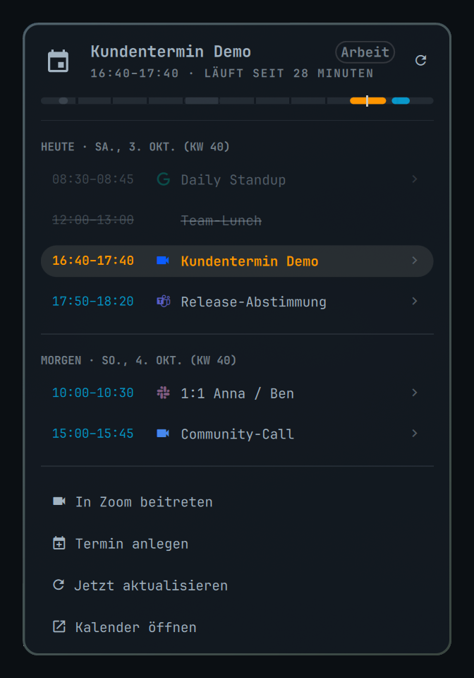
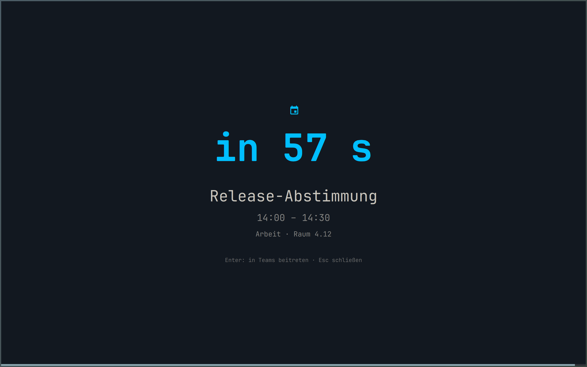

# OMeetingBar

**MeetingBar for Omarchy.** Your next Google Calendar meeting in the bar, a two-day agenda
popup on click — and a fullscreen alert shortly before a meeting starts that you cannot miss,
because ordinary notifications are exactly what you miss when you are deep in work.


## Why

The fullscreen alert is the point of this plugin. A minute before a meeting the screen goes
dark on every monitor and shows the meeting, the countdown and the join key. A toast in the
corner does not do that. The bar entry and the agenda popup are what MeetingBar users expect
around it.

- **Bar entry** — the next meeting with time, title and countdown, coloured by state:
  turquoise while it is ahead, orange once it is running.
- **Agenda popup** (left click) — today and tomorrow, MeetingBar-style: a timeline strip, one
  row per meeting with the provider's mark in its brand colour, finished rows dimmed, the running
  one emphasised, declined invitations struck through, then the next few later meetings
  ("UPCOMING"; German UI: "DEMNÄCHST"), and footer actions (join, create, refresh, open calendar).
- **Fullscreen alert** — configurable lead time (default 60 s), auto-dismiss, `Enter` joins the
  meeting in its provider (the hint names it: "join via Teams"; German UI: "in Teams beitreten"), `Esc` dismisses it and
  silences the sound. It also sends a critical notification and plays a sound, so the alert
  reaches you even when the overlay cannot (see limits). The display is woken once, right
  before the alert is shown — never under the lock screen.
- **Notifications that clean up after themselves** — when a meeting ends, its notification is
  replaced by a short "Meeting ended" (Omarchy shows it for at least 5 s), so you do not come
  back from a call taken on your phone to a stack of stale ones; the same happens as soon as a
  meeting is cancelled or declined. A click joins until the meeting ends, also before it
  starts; afterwards it just closes the toast, and so it does for a meeting you have declined.
  A right click always just closes. Toasts sent before a shell restart or reboot are not taken
  down; they close on click.
- **Video providers** — join links from Google Meet, Microsoft Teams, Zoom, Webex, Jitsi
  (meet.jit.si, 8x8.vc), Whereby, GoTo Meeting, Slack Huddles and Discord are recognised in the
  invite's conference data, location or description. Meet, Teams, Slack and Discord show their
  own mark; the others share a camera glyph and are told apart by brand colour. Colours are
  adjusted automatically to stay readable (at least 3:1) on light and dark themes. Marks come
  from the bar's Nerd Font — no logo files are bundled.
- **Google Workspace / Google Calendar** through GNOME Online Accounts + evolution-data-server.
  No Google Cloud project, no OAuth client of your own: GOA ships a verified one.

## Screenshots

The bar entry while a meeting is running, and the agenda popup (all meetings shown are made up):




The fullscreen alert, a minute before the next meeting:



## Limits — read these first

1. **A locked session cannot be drawn over.** Omarchy's lock is `ext-session-lock`, which
   renders above every layer-shell surface. The plugin therefore holds an idle inhibitor from
   ten minutes before a meeting so the session does not lock into the alert; if it is already
   locked, the notification and the sound still fire and the fullscreen alert is shown as soon
   as you unlock, as long as the meeting is still inside its grace window.
2. **A suspended laptop is not woken.** `WakeSystem=` needs system privileges; a user plugin
   cannot do it. After resume, a meeting that started within the grace window (default
   5 min) still alerts.
3. **The `ics` backend lags.** Google regenerates private iCal feeds roughly once a day. It
   exists as a backstop only; use `eds`.
4. **Two UI languages.** German and English, picked from the shell's locale the way Qt picks
   it — `LC_ALL`, `LC_MESSAGES` or `LANG`, and `LANGUAGE`'s first entry wins unless that locale
   is unset, `C` or `POSIX`: `de*` → German, everything else → English — or pinned with
   `language` in the config.
   Other languages: `Strings.js` and the `MESSAGES` table in `bin/omeetingbar-fetch` are the
   two places to add one.
5. **The timeline strip has no hour numbers.** A `Text` in that row triggers a Qt polish loop
   on the author's machine that was bisected but not root-caused; the notches carry the hour
   grid. Details in `docs/SPEC.md`.

## Requirements

- Omarchy 4.x (Quickshell shell). Verified on Omarchy 4.0.x, Hyprland 0.56, Quickshell 0.3.1,
  Qt 6.11.
- For the `eds` backend (Google Calendar):
  `evolution-data-server`, `gnome-online-accounts`, `gnome-online-accounts-gtk`
  (the standalone account dialog — no GNOME session or `gnome-control-center` needed),
  `python-gobject` (already on Omarchy). About 11 packages / 70 MiB on a stock install.
- On every backend `python-gobject` is what lets a meeting's notification carry its title and
  location; without it the notification says "Meeting" and the time range only.
- Sound: `pipewire-audio` (`pw-play`) and `sound-theme-freedesktop` — both on Omarchy already.

## Install

```bash
omarchy plugin add https://github.com/disy-mk/OMeetingBar.git
cd ~/.config/omarchy/plugins/io.github.disy-mk.omeetingbar
./install.sh
```

`install.sh` never runs `sudo`. It validates the manifest, creates
`~/.config/omarchy/omeetingbar.json` from `config.example.json` (only if absent), registers
the plugin with the running shell, puts the widget on the bar and installs a small wrapper
at `~/.local/bin/omeetingbar-fetch`. It ends with a numbered list of the steps only you can do:

1. Install what is still missing of `evolution-data-server`, `gnome-online-accounts`,
   `gnome-online-accounts-gtk` and `python-gobject` — it prints the exact
   `sudo pacman -S --needed …` line.
2. Add your Google account in `gnome-online-accounts-gtk` and enable "Calendar".
3. While packages are missing, the script suggests running on the `demo` backend meanwhile (a
   `jq` one-liner on the config). If you did that, switch `backend` back to `eds` once 1 and 2
   are done; it prints that line too.
4. Test: `omarchy-shell omeetingbar test`, `omarchy-shell omeetingbar status`,
   `omeetingbar-fetch --diagnose`.

Installing the packages and connecting the account need no shell restart: the fetcher is a
separate process started fresh on every refresh, so `omarchy-shell omeetingbar refresh` (or the
next interval) picks them up. Updating the plugin itself does need one (see Update).

Until the packages are installed (and unless you switched to `demo`) the bar shows a dim
`󰃭 —` with the reason in its tooltip;
`omarchy-shell omeetingbar test` shows the fullscreen alert regardless, so you can see it
before connecting anything.

## Update

```bash
omarchy plugin update io.github.disy-mk.omeetingbar && omarchy restart shell
```

Run it while the screen is unlocked: Omarchy refuses to restart a locked shell. The update
replaces the files, but the running service keeps its old code until the shell restarts.
`omarchy-shell omeetingbar status | jq -r .version` prints the version that is running. A
service from before 1.1.0 reports neither `version` nor `restartNeeded`, so `null` there means
the restart is still due; from 1.1.0 on, `restartNeeded` in the same JSON is `true` while the
installed version differs from the running one. As long as an old service is still running,
the bar shows a warning: the fetcher detects it on its next run and asks for the restart in
the tooltip.

## Remove

```bash
~/.config/omarchy/plugins/io.github.disy-mk.omeetingbar/install.sh --uninstall
omarchy plugin remove io.github.disy-mk.omeetingbar
```

`--uninstall` first disables the plugin, which removes the bar entry (with any `omarchy bar set`
values on it) and stops the service (fetches, toasts, sound) and the fullscreen alert, and then
removes the wrapper and the runtime cache (`$XDG_RUNTIME_DIR/omeetingbar/`). If the shell does
not answer, it says so and how to disable the plugin by hand: until then the service writes the
cache again. It leaves `~/.config/omarchy/omeetingbar.json` in place (your settings) and does not
touch the packages or the Google account — remove those yourself if you want them gone
(`gnome-online-accounts-gtk`, `sudo pacman -Rs …`). Meeting toasts still on screen stay there
until you close them (a click no longer joins), and toasts you already closed stay in Omarchy's
notification history until you clear it (`omarchy-shell notifications clear`, which empties the
whole history).

## Configuration — `~/.config/omarchy/omeetingbar.json`

Every key is optional; the defaults below apply when it is missing or `null`. One rule holds for
every value: a number may also be written as a string (`"120"`), is rounded to a whole number
and kept inside its range; a switch also takes `1`/`0` and `"yes"`/`"no"`/`"on"`/`"off"`; a
list may be a single string; text settings (`language`, `sound`, the colours) must be strings.
A value that does not fit, a value moved into its range and a key nothing reads (a typo) are
named in the bar's tooltip (its first 140 characters; `omarchy-shell omeetingbar status` shows
all of it as `cacheWarning`). A value that does not fit counts as missing — for the fetcher's
own keys (all but `ics_urls`, `language` and the ones only the bar and the alert read) the last
valid value applies instead.

A save applies at once and starts a fetch; alerts wait for it, up to 30 s, so a new exclusion is
normally in force before the next alert fires. While the file cannot be read as JSON — a
trailing comma, a half-written save — nothing loses its last valid value: the bar, the alert and
the toasts keep theirs, and the fetcher keeps its own, remembered for this in the runtime cache;
the tooltip says so. Fixing the file starts a fetch too. The gaps: the runtime cache is gone after
a reboot or the end of the login session, and a shell restart, a plugin reload or a bar created
meanwhile (a new monitor) starts from the defaults — in each case only until the file is fixed.

| Key | Default | Meaning |
|---|---|---|
| `backend` | `"eds"` | `eds` = Google via GOA/Evolution. `ics` = private iCal URLs (backstop, see limits). `demo` = synthetic events, no account needed. |
| `ics_urls` | `[]` | Private ICS URLs for `backend: "ics"`. Treated as secrets — never logged. |
| `lookahead_minutes` | `10080` | How far ahead meetings are fetched (7 days, at most 30). The bar always names the next meeting in this window — on a Friday evening that is Monday's first one. Never shortens the two-day agenda. |
| `refresh_seconds` | `300` | Minimum spacing between network refreshes (EDS `refresh_sync`). EDS alone would poll hourly. |
| `fetch_interval_seconds` | `60` | How often the service reads the local calendar cache, 5 to 900 s. Backs off to 15 min while a backend keeps failing. |
| `alert_lead_seconds` | `60` | Fullscreen alert this many seconds before start, 0 to 3600. |
| `auto_dismiss_seconds` | `90` | The alert closes itself after this long, 0 to 600; `0` keeps it until dismissed, for 10 min at most. |
| `colors.running` | `#FF9500` | Colour for a running meeting — bar entry and alert countdown. `#rrggbb` only. |
| `colors.upcoming` | `#00BEFF` | Colour for an upcoming meeting. |
| `inhibit_lead_seconds` | `600` | Hold a Wayland idle inhibitor from this long before start, so the session cannot lock into the alert — until the alert has been on screen for 5 s (the alert then holds the session for at most 3 min itself) or `start + grace` has passed. 0 to 7200. |
| `grace_seconds` | `300` | A meeting whose start is at most this long ago still alerts (suspend, lock). Older ones never do. At most 3600. |
| `sound` | `…/alarm-clock-elapsed.oga` | An audio file, played with `pw-play` for at most 60 s. An absolute path or `~/…`; `""` or `false` = silent, `null` or anything that is neither a path nor a switch = the default. A path that is no file shows up in the log as `sound-missing`. |
| `language` | `"auto"` | `"de"`, `"en"` or `"auto"` (the shell's locale, see limit 4). Bar, popup, alert, notifications and the fetcher's messages follow it; dates and weekday names too. Times stay 24 h. |
| `notify` | `true` | Also send a critical notification (bypasses DND) through `bin/omeetingbar-notify`, which gets the text on stdin rather than as an argument (Omarchy's daemon still passes it to a bash job when it saves the toast; see privacy). Once the meeting is over it is replaced by a short "Meeting ended". `false` = no notification at all. |
| `notify_details` | `true` | The notification shows the title, the time range and the location (or the calendar name). `false` = a toast without title, location or calendar name: only "Meeting"/"Termin" and the time range. See privacy. |
| `wake_display` | `true` | `omarchy-brightness-display on` once, right before the alert is shown — never under the lock screen. |
| `skip_all_day` | `true` | Keep all-day entries out of the cache. All-day entries never alert either way. |
| `skip_declined` | `true` | Declined invitations never alert but are listed, struck through, in the agenda. `false` treats them like any other meeting. |
| `min_duration_minutes` | `0` | Ignore meetings shorter than this. |
| `title_blocklist` | `[]` | Title fragments that exclude a meeting everywhere (case-insensitive). A meeting without a title matches `untitled` and `ohne Titel`. |
| `calendars_exclude` | `[]` | Calendar names or UIDs to ignore (case-insensitive; a name as it reads on screen). |
| `widget.warn_minutes` | `15` | Inside this window the bar entry shows full-strength colour; outside it 75 % alpha. A meeting this close to its start also takes over the bar entry from one still running. `0` turns both off; at most 1440. |
| `widget.max_title_chars` | `28` | Truncate the title in the bar, 4 to 200. |
| `widget.hide_when_empty` | `true` | Collapse the bar entry when the agenda is empty. |

The three `widget.*` keys can also be set on the bar entry itself, e.g.
`omarchy bar set io.github.disy-mk.omeetingbar warn_minutes 10`. A value set there wins over
`omeetingbar.json` (even one the rules reject, which then means the default — the tooltip cannot
report it); `omarchy bar set io.github.disy-mk.omeetingbar warn_minutes null --json` hands the
key back to the file.

## Using it

- **Left click** the bar entry → agenda popup. **Right/middle click** → refresh.
- In the popup: `↑`/`↓` or `j`/`k` move, `Enter` or `Space` joins the selected meeting, `r`
  refreshes, `Esc` closes, `Tab`/`Shift+Tab` switch to the next/previous panel.
- In the alert: `Enter` joins, `Esc` (or any other key, or a click) dismisses. Either way the
  sound stops. Keys and clicks in the first second after it appears are ignored, and so is
  typing that goes on past it (keys less than 0.4 s apart), so input already on its way can
  neither join a meeting you have not read yet nor clear the alert unread. `Esc` always works
  once that first second is over.
- On a meeting notification: click joins until the meeting ends, also before it starts
  (afterwards it only closes); right click always just closes.
- From a keybinding or script:

```bash
omarchy-shell omeetingbar-agenda toggle   # open the agenda on the focused monitor, or close the open one
omarchy-shell omeetingbar status          # JSON: backend, cache age, alert state (ids and times, no titles)
omarchy-shell omeetingbar test            # fullscreen alert + sound now, synthetic, no calendar needed
omarchy-shell omeetingbar preview         # the alert for the meeting it would fire on next; nothing is marked as alerted
omarchy-shell omeetingbar refresh         # run the fetcher now
omarchy-shell omeetingbar dismiss         # close the alert, stop the sound, drop queued alerts
omeetingbar-fetch --refresh               # fetch now with a network refresh, ignoring refresh_seconds
omeetingbar-fetch --diagnose              # packages, typelibs, GOA accounts, calendars found
omeetingbar-fetch --in-seconds 90         # inject a test meeting 90 s out → real alert at T-60
```

With the `eds` backend every refresh from the plugin — a right click, `r`, "Refresh now",
`omarchy-shell omeetingbar refresh` — reads EDS's local copy at once, but asks Google again only
once the last network refresh is `refresh_seconds` old (default 5 min). After a VPN outage,
`omeetingbar-fetch --refresh` gets the current state right away.

Hyprland example — `~/.config/hypr/bindings.lua` (`SUPER + SHIFT + M` is Omarchy's Music key,
`SUPER + CTRL + M` is free):

```lua
o.bind("SUPER + CTRL + M", "Meeting agenda", "omarchy-shell omeetingbar-agenda toggle")
```

## Troubleshooting

| Symptom | Look here |
|---|---|
| Dim `󰃭 —` in the bar | `omarchy-shell omeetingbar status`, then `omeetingbar-fetch --diagnose`. Usually: packages missing, or no Google account connected yet. |
| No alert | `status`: is the meeting in the cache (match it by start time — `status` prints no titles), is it `declined`, was it already `notified`? Was the session locked (limit 1)? |
| Tooltip says "Calendar sync failed", "Calendar sync partly failed (n of m)" or "Last successful calendar sync … ago" (German UI: "Kalender-Sync fehlgeschlagen", "Kalender-Sync teilweise fehlgeschlagen (n von m)", "Letzter erfolgreicher Kalender-Sync vor …") | EDS cannot reach Google: VPN or network down, or the account's login expired — open `gnome-online-accounts-gtk` and sign in again. Until then the plugin shows EDS's last local copy. `omeetingbar-fetch --diagnose` prints the last attempt and the last success. |
| Tooltip says "Google sign-in needed – sign in again in gnome-online-accounts-gtk" (German UI: "Google-Anmeldung nötig – …") | EDS is waiting for credentials: the Google sign-in expired or was revoked. Open `gnome-online-accounts-gtk` and sign in again; the next refresh clears the hint. |
| Nothing changes after editing QML | `omarchy restart shell`. Saving a file reloads plugin code, but a running third-party *service* is not replaced by it — measured, not assumed. Config edits apply on save. |
| Logs | `journalctl --user -t omarchy-shell -f` — the plugin logs one line per state change, never a meeting title. |

## Security and privacy

- GOA stores the Google refresh token through libsecret in your keyring. On a machine with
  autologin and an unencrypted keyring that token is readable by any process running as you —
  check your setup before connecting a work account.
- The event cache lives in `$XDG_RUNTIME_DIR/omeetingbar/` (tmpfs, mode 0600, gone on
  reboot) and holds only title, times, join URL, calendar name and location, plus a calendar
  key (the EDS source id, or a hash of an ICS feed's URL, never the URL) and the dates of all-day
  entries — no attendees, no descriptions. It also keeps the fetcher's last valid settings,
  your exclusions (`title_blocklist`, `calendars_exclude`) among them but never the `ics_urls`,
  so that a broken config file does not switch them off.
  `omarchy-shell omeetingbar status` prints ids and times, never titles.
- The plugin writes nothing from the calendar to the journal. One exception: joining hands the
  link to Omarchy's launcher, which logs the browser command line — link and passcode
  included — to the persistent user journal.
- A meeting's toast shows its title plus the location — or, without one, the calendar name,
  which is often an account address. Omarchy's notification daemon briefly passes that text to
  a bash job as an argument when it saves the toast, and keeps open toasts under
  `~/.local/state/omarchy/notifications/`, where they survive a reboot. A toast replaced by
  "Meeting ended" reaches Omarchy's history without content; one you closed or clicked earlier
  keeps its text there — on disk under `~/.local/state/omarchy/notifications/history/`, the
  newest 10, across reboots (`omarchy-shell notifications clear` empties it). Set
  `notify_details` to `false` to send toasts without meeting content (only "Meeting"/"Termin"
  and the time range), or `notify` to `false` to send none. The join URL never reaches the
  daemon.
- The fullscreen alert covers every monitor, and a screen share shows it — title, calendar
  and location included — like everything else on a shared monitor; the same goes for the
  toasts. On Hyprland 0.56 you can keep the alert out of every share by adding this to the
  end of `~/.config/hypr/hyprland.lua`; the share then shows a black surface where the alert
  is:

  ```lua
  hl.layer_rule({ match = { namespace = "^omeetingbar-alert$" }, no_screen_share = true })
  ```

  The same rule for `"^omarchy-notifications$"` blacks out every toast in a share, not only
  this plugin's; `notify_details: false` keeps meeting content out of the toasts instead.
- The plugin's own processes never carry calendar content in their arguments, where any local
  user could read it from `/proc`: notifications go to a small helper over stdin, the click
  action carries only the event id and the grace window, and the join link leaves the 0600
  cache only when the browser is launched with it. Without `python-gobject` the helper falls
  back to a content-free toast (the word "Meeting" and the time range).
- Only `https://` join URLs are ever handed to the browser; every component re-checks this.
- The fullscreen alert ignores keys and clicks for its first second, and typing that goes on
  past it, so input in flight can neither join a meeting from an invite you have not seen nor
  clear the alert unread. Alerts are bounded: at most 8 wait in the queue; of meetings due
  together the first 3 get their own notification and the rest share one (a fourth alone still
  gets its own); at most 512 occurrences are read from the cache.
- `install.sh` never elevates privileges. It prints the `pacman` command for you to run.
- Plugins run unsandboxed inside `omarchy-shell`. Read the code before enabling it — it is
  about 9,350 lines of QML, JavaScript, Python and shell, and `docs/SPEC.md` explains every decision.

## How it works

`Service.qml` ticks once a second against the wall clock (no monotonic timers — those fire
late after suspend), reads the cache written by `bin/omeetingbar-fetch`, and fires when a
meeting is `alert_lead_seconds` away. "Notified" and "shown" are separate, persisted states:
the overlay counts as shown only when the shell confirms it is open, and an unconfirmed alert
is re-summoned inside its grace window — so a shell restart mid-alert cannot swallow it.
Overlapping alerts queue. `Alert.qml` is the fullscreen surface, `Widget.qml` the bar entry
and host of `Popup.qml`. The cache is the whole two-day agenda; a single predicate,
`isAlertable()`, decides what may alert. The full contract, including everything that was
measured rather than assumed, is in [`docs/SPEC.md`](docs/SPEC.md).

## Kurzfassung auf Deutsch

OMeetingBar ist ein MeetingBar-Ersatz für Omarchy: der nächste Google-Kalender-Termin in der
Bar (türkis = steht an, orange = läuft), per Linksklick eine Agenda für heute und morgen mit
Timeline, und **eine Minute vor dem Meeting ein Vollbild-Alarm**, der den Bildschirm belegt —
weil man normale Benachrichtigungen im Tunnel nicht wahrnimmt. `Enter` tritt bei, `Esc`
schließt und stoppt den Ton. Zum Meeting-Ende wird die Meeting-Notification durch ein kurzes
"Meeting beendet" ersetzt (Omarchy zeigt es mindestens 5 s), ebenso sobald ein Termin abgesagt
oder abgelehnt wird; Notifications von vor einem Shell-Neustart oder Reboot bleiben stehen. Ein
Klick tritt bei, bis das Meeting endet (auch schon vor Beginn), danach schließt er nur, ebenso
bei einem abgelehnten Termin; ein Rechtsklick schließt immer nur. Die Notification zeigt Titel,
Uhrzeit und Ort (sonst den Kalendernamen); mit `notify_details: false` nur "Termin" und die
Uhrzeit. Wer den Bildschirm teilt, kann den Alarm per Hyprland-Regel aus der Freigabe nehmen
(siehe "Security and privacy").

Installation: `omarchy plugin add https://github.com/disy-mk/OMeetingBar.git`, dann
`./install.sh` im Plugin-Ordner ausführen; es druckt den `pacman`-Befehl für die noch
fehlenden der benötigten Pakete (`evolution-data-server`, `gnome-online-accounts`,
`gnome-online-accounts-gtk`, `python-gobject`), die Anleitung, das Google-Konto in
`gnome-online-accounts-gtk` zu verbinden, und Testbefehle; solange Pakete fehlen, schlägt es
das `demo`-Backend vor. Für Pakete und Konto ist kein Shell-Neustart nötig, der nächste Abruf
übernimmt beide.

Update: `omarchy plugin update io.github.disy-mk.omeetingbar && omarchy restart shell`, bei
entsperrtem Bildschirm (eine gesperrte Shell startet Omarchy nicht neu). Erst der
Shell-Neustart ersetzt den laufenden Dienst; bis dahin zeigt die Bar eine Warnung, und
`omarchy-shell omeetingbar status | jq -r .version` nennt die laufende Version (`null` = älter
als 1.1.0, der Neustart steht also noch aus).

Grenzen: über einen **gesperrten** Bildschirm kann kein Plugin zeichnen — der Alarm wird dann
nach dem Entsperren nachgezogen, Notification und Ton kommen trotzdem; ein Laptop im Suspend
wird nicht geweckt. Die Oberfläche ist deutsch oder englisch, je nach Systemsprache
(`language` in der Config erzwingt eine). Alle Einstellungen stehen in
`~/.config/omarchy/omeetingbar.json` (Tabelle oben), testen kannst du mit
`omarchy-shell omeetingbar test`.

## License

MIT — see [`LICENSE`](LICENSE).
